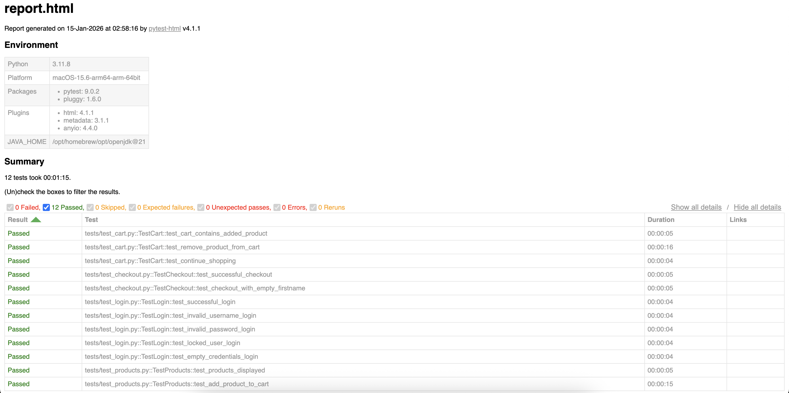

# E-Commerce Test Automation 🧪

Selenium ve Python kullanarak geliştirilmiş e-ticaret test otomasyon projesi. Page Object Model design pattern kullanılarak yapılandırılmıştır.

## 🎯 Proje Hakkında

Bu proje, e-ticaret sitelerinin temel fonksiyonlarını otomatik olarak test etmek için geliştirilmiştir. Demo olarak [SauceDemo](https://www.saucedemo.com) sitesi kullanılmaktadır.

**Geliştirici:** Enes Okur  
**LinkedIn:** [linkedin.com/in/enes-okur-133871136](https://www.linkedin.com/in/enes-okur-133871136)

## 🚀 Özellikler

- **Page Object Model (POM)**: Sürdürülebilir ve ölçeklenebilir test yapısı
- **Pytest Framework**: Modern ve güçlü test framework'ü
- **HTML Reports**: Detaylı test sonuç raporları
- **WebDriver Manager**: Otomatik driver yönetimi
- **Kapsamlı Test Senaryoları**:
  - ✅ Login testleri (valid/invalid/locked user)
  - ✅ Ürün listeleme ve sepete ekleme
  - ✅ Sepet işlemleri
  - ✅ Checkout süreci (end-to-end)

## 📋 Gereksinimler

- Python 3.8+
- Chrome Browser

## 🛠️ Kurulum

1. Projeyi klonlayın:
```bash
cat > README.md << 'EOF'
# E-Commerce Test Automation 🧪

Selenium ve Python kullanarak geliştirilmiş e-ticaret test otomasyon projesi. Page Object Model design pattern kullanılarak yapılandırılmıştır.

## 🎯 Proje Hakkında

Bu proje, e-ticaret sitelerinin temel fonksiyonlarını otomatik olarak test etmek için geliştirilmiştir. Demo olarak [SauceDemo](https://www.saucedemo.com) sitesi kullanılmaktadır.

**Geliştirici:** Enes Okur  
**LinkedIn:** [linkedin.com/in/enes-okur-133871136](https://www.linkedin.com/in/enes-okur-133871136)

## 🚀 Özellikler

- **Page Object Model (POM)**: Sürdürülebilir ve ölçeklenebilir test yapısı
- **Pytest Framework**: Modern ve güçlü test framework'ü
- **HTML Reports**: Detaylı test sonuç raporları
- **WebDriver Manager**: Otomatik driver yönetimi
- **Kapsamlı Test Senaryoları**:
  - ✅ Login testleri (valid/invalid/locked user)
  - ✅ Ürün listeleme ve sepete ekleme
  - ✅ Sepet işlemleri
  - ✅ Checkout süreci (end-to-end)

## 📋 Gereksinimler

- Python 3.8+
- Chrome Browser

## 🛠️ Kurulum

1. Projeyi klonlayın:
```bash
git clone https://github.com/okurenes/ecommerce-test-automation.git
cd ecommerce-test-automation
```

2. Virtual environment oluşturun ve aktifleştirin:
```bash
python3 -m venv venv
source venv/bin/activate  # Linux/Mac
venv\Scripts\activate   # Windows
```

3. Gerekli paketleri yükleyin:
```bash
pip install -r requirements.txt
```

## ▶️ Testleri Çalıştırma

Tüm testleri çalıştır:
```bash
pytest
```

Belirli bir test dosyasını çalıştır:
```bash
pytest tests/test_login.py
```

Belirli bir test metodunu çalıştır:
```bash
pytest tests/test_login.py::TestLogin::test_successful_login
```

Verbose mode ile çalıştır:
```bash
pytest -v
```

## 📊 Test Raporları

Testler çalıştıktan sonra HTML raporu `reports/report.html` dosyasında oluşturulur.

### Örnek Test Raporu:



Raporu görüntülemek için:
```bash
open reports/report.html  # Mac
```

## 📁 Proje Yapısı
```
ecommerce-test-automation/
├── pages/              # Page Object sınıfları
│   ├── base_page.py
│   ├── login_page.py
│   ├── products_page.py
│   ├── cart_page.py
│   └── checkout_page.py
├── tests/              # Test senaryoları
│   ├── test_login.py
│   ├── test_products.py
│   ├── test_cart.py
│   └── test_checkout.py
├── utils/              # Yardımcı fonksiyonlar
│   ├── driver_factory.py
│   └── test_data.py
├── reports/            # Test raporları
├── conftest.py         # Pytest fixture'ları
├── pytest.ini          # Pytest konfigürasyonu
└── requirements.txt    # Python bağımlılıkları
```

## 🧪 Test Kapsamı

### Login Testleri
- ✅ Başarılı login
- ✅ Geçersiz kullanıcı adı
- ✅ Geçersiz şifre
- ✅ Kilitli kullanıcı
- ✅ Boş credentials

### Ürün Testleri
- ✅ Ürünlerin listelenmesi
- ✅ Sepete ürün ekleme

### Sepet Testleri
- ✅ Eklenen ürünün sepette görünmesi
- ✅ Sepetten ürün çıkarma
- ✅ Alışverişe devam etme

### Checkout Testleri
- ✅ Başarılı checkout süreci (E2E)
- ✅ Form validasyonları

## 🔧 Teknik Detaylar

- **Design Pattern:** Page Object Model
- **Test Framework:** Pytest
- **Web Automation:** Selenium WebDriver
- **Browser:** Chrome (WebDriver Manager ile otomatik yönetim)
- **Reporting:** pytest-html

## 📝 Notlar

- Testler Chrome browser üzerinde çalışmaktadır
- Headless modda çalıştırmak için `driver_factory.py` dosyasında `headless=True` parametresi kullanılabilir
- Test datası `utils/test_data.py` dosyasında merkezi olarak yönetilmektedir

## 🤝 Katkıda Bulunma

Pull request'ler memnuniyetle karşılanır. Büyük değişiklikler için lütfen önce bir issue açarak neyi değiştirmek istediğinizi tartışın.

## 📧 İletişim

Enes Okur - okurenes.official@gmail.com

Proje Linki: [https://github.com/okurenes/ecommerce-test-automation](https://github.com/okurenes/ecommerce-test-automation)
